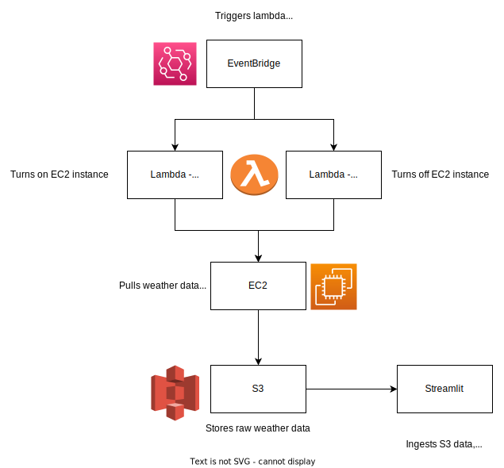

# UK Weather Patterns

All weather data is grabbed from the [met office
](https://www.metoffice.gov.uk/research/climate/maps-and-data/uk-and-regional-series) and inspiration for the graphs are from Nigel Marriot's [blog](https://marriott-stats.com/nigels-blog/). 

This was purely an exercise to practice AWS microservices. 

Check out the streamlit app [here](https://weathergraphing-n3afxbnpm3dp7rdkmtot8r.streamlit.app/).

Read more about how this was made on my [portfolio site.](https://jmoro0408.github.io/project/weather-graphing-on-aws)
## Flow

1. On the 1st of each month an EventBridge schedule triggers a Lambda Function. 
2. Lambda function starts an EC2 instance
3. A bash script is triggered on startup:
    * CD's to the project folder
    * activates the virtual environment
    * runs a python script
4. The script then:
    * pulls weather data from the met office site for Rainfall, sunshine, max temp, min temp, and mean temp. 
    * Saves this raw data to an S3 bucket. 
5. 30 minutes after the Lambda function triggered the EC2 startup, another EventBridge schedule triggers a second lambda function to stop the EC2 instance. 

We now have monthly updated weather data saved to an S3 bucket. 

Meanwhile, hosted on Streamlit, the data is pulled from S3, transformed, and plotted on interactive charts with Plotly. 

# About the data 